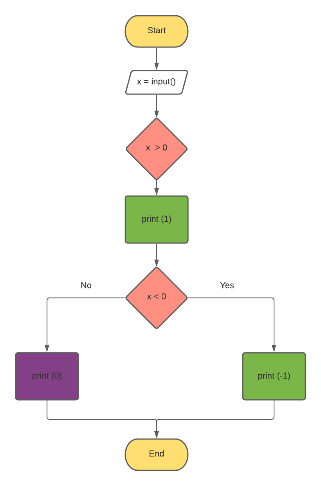

#Solution to if exercises in snakify

##1. Odd numbers:


```.py
# Read an integer
a = int(input())
b = int(input())

if a>b:
    print(b) # a is less than b

else:
    print(a) #b is less than a
    
#END
```

##2.Sign function:

```.py
# get input 
x = int(input())

if x > 0:
    print(1)
    
elif x < 0:
    print(-1)
    
else: 
    print (0)
    
#END
```

##3.Minimum of 3 numbers:

```.py
# Read an integer:
a = int(input())
b = int(input())
c = int(input())

if c < a and c < b:
    print (c)

if a < b and a < c:
    print(a)
    
elif b < c and b < a:
    print (b)
#END
```

##4.Equal numbers: 


```.py
a = int(input())
b = int(input())
c = int(input())

if a==b==c:
    print(3)

elif a==b!=c or a==c!=b or b==c!=a:
    print(2)
    
else:
    print(0)
#END
```

##5.Rook move:


```.py
a = int(input())
b = int(input())
c = int(input())
d = int(input())

if a==c or b==d:
    print ("YES")
    
else: 
    print("NO")
#END
```

##6. Chess board- same color:

```.py
a = int(input())
b = int(input())
c = int(input())
d = int(input())

if (a + b) %2 == (c + d) %2: 
    print ('YES')


else:
    print('NO')
#END
```

##7.King move:

```.py
a = int(input())
b = int(input())
c = int(input())
d = int(input())

if abs(a-c) <= 1 and abs(b-d) <= 1:
    print('YES')
    
else:
    print('NO')
#END
```
##8.Bishop move:


```.py
a = int(input())
b = int(input())
c = int(input())
d = int(input())

if abs(a-c) == abs(b-d):
    print('YES')

    
else:
    print('NO')
#END
```

##9.Queen move:


```.py
a = int(input())
b = int(input())
c = int(input())
d = int(input())

if a == c or b == d or abs(a-c) == abs(b-d):
    print('YES')
    
else: 
    print('NO')
#END
```

##10.knight move:


```.py
a = int(input())
b = int(input())
c = int(input())
d = int(input())
d1 = abs(a - c)
d2 = abs(b - d)
if d1 == 1 and d2 == 2 or d1==2 and d2 ==1:
    print('YES')
    
else:
    print('NO')
#END
```

##11.Chocolate bar:

```.py
n = int(input())
m = int(input())
k = int(input())

if k < n * m and ((k % n == 0)or (k % m == 0)):
    print('YES')
    
else: 
    print('NO')
#END
```

##12.Leap year:


```.py
a = int(input())

if (a % 4) == 0 and not (a % 100) == 0 or(a % 400) ==0:
    print('LEAP')
       
else: 
    print('COMMON')
#END
```
